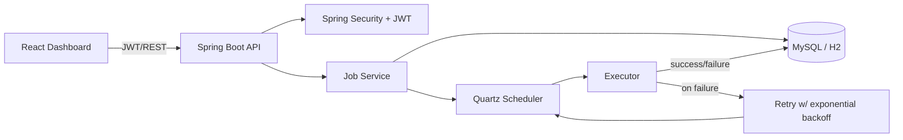

# Chronus — Distributed Job Scheduler

A backend-focused job scheduling platform: submit one-time or recurring jobs over a REST API, and
Chronus runs them, retries failures with exponential backoff, and keeps an immutable execution log —
all behind JWT auth with role-based access. Spring Boot + Quartz backend, React dashboard.

> **Runs with zero setup.** `./mvnw spring-boot:run -Dspring-boot.run.profiles=dev` boots the whole
> backend on an in-memory H2 database with an in-memory scheduler — no MySQL, no Kafka, nothing to install.

## Why this project

Most portfolio apps are CRUD over a database. Chronus is the opposite: the interesting part isn't
storing a job, it's **running it reliably** — scheduling, recurrence, failure handling, retries with
backoff, and an audit trail — the concerns a real distributed scheduler (cron-as-a-service,
CI runners, ETL orchestrators) has to solve.

## Architecture



**Runtime flow:** a job row → a Quartz trigger → an executor thread → an immutable `JobExecution`
record. On failure the executor re-schedules itself through Quartz with `min(5·2ⁿ⁻¹, 300)s` backoff,
up to `maxAttempts`, then marks the job `FAILED`.

### Scale-out path (designed, not yet wired)
The executor consumes work through the scheduler as a queue. That's the seam: swap the in-process
trigger for **Kafka** + stateless **worker nodes** and the retry/execution logic is unchanged.
Add **ELK / Prometheus + Grafana** on the execution log for observability. The `prod` profile already
runs a **persistent Quartz JDBC store** on MySQL so triggers survive restarts and can be shared across nodes.

## Features

- **Auth** — signup/login, JWT (HS256, stateless), BCrypt, role-based access (USER/ADMIN), seeded admin.
- **Jobs** — create one-time or recurring (`minutely`/`hourly`/`daily`/`weekly`), reschedule, cancel.
- **Execution** — lifecycle `SCHEDULED → RUNNING → SUCCESS | RETRYING → FAILED | CANCELLED`.
- **Retry** — automatic exponential backoff up to a per-job attempt cap.
- **Audit** — every run recorded (start/end/status/error) and queryable per job.
- **Zero-infra dev profile** (H2 + RAM scheduler) and a **MySQL prod profile**.

## API

| Method | Path | Auth | Purpose |
|---|---|---|---|
| POST | `/auth/signup` | public | Register → JWT |
| POST | `/auth/login` | public | Login → JWT |
| GET | `/auth/me` | token | Current user |
| POST | `/jobs` | token | Create a job (one-time or recurring) |
| GET | `/jobs` | token | List jobs |
| GET | `/jobs/{id}` | token | Job detail + attempt count |
| PUT | `/jobs/{id}/reschedule` | token | Change schedule/recurrence |
| DELETE | `/jobs/{id}` | token | Cancel (keeps audit trail) |
| GET | `/jobs/{id}/logs` | token | Execution history |

Demo commands (no setup): `noop` / `log:<msg>` succeed, `fail` throws (to watch retries),
`run_java_code` compiles + runs an uploaded `.java` file.

## Run it

```bash
# Backend — zero infrastructure
cd chronos
./mvnw spring-boot:run -Dspring-boot.run.profiles=dev      # http://localhost:8080
# seeded admin: admin@chronos.dev / admin12345 ; H2 console at /h2-console

# Frontend
cd ../chronos-ui
npm install && npm run dev                                  # http://localhost:5173
```

Production uses the `prod` profile (MySQL + persistent Quartz store); set `DATABASE_URL`, `DB_USER`,
`DB_PASSWORD`, `CHRONOS_JWT_SECRET`, `CHRONOS_ADMIN_PASSWORD`, `CHRONOS_CORS_ORIGINS` via env.

## Tech
Java 17 · Spring Boot 3.5 · Spring Security + JWT (jjwt) · Quartz · Spring Data JPA · MySQL / H2 ·
React + Vite + Tailwind.

## Status & roadmap
- ✅ Zero-infra boot, JWT auth + RBAC, job CRUD, recurrence, execution, exponential-backoff retry, audit log.
- ⏳ Dashboard UI polish · integration test suite · Docker/compose + cloud deploy.
- 🔭 Kafka + worker nodes · ELK/Grafana observability · email/SMS notifications.
